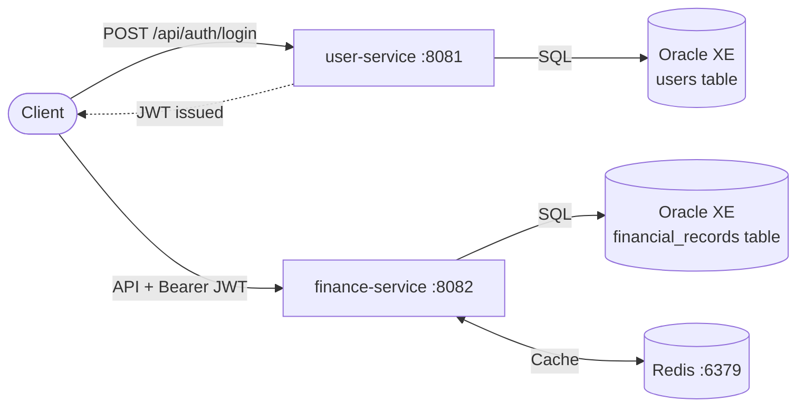
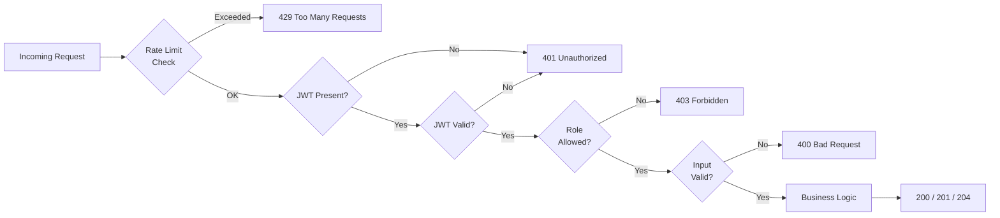
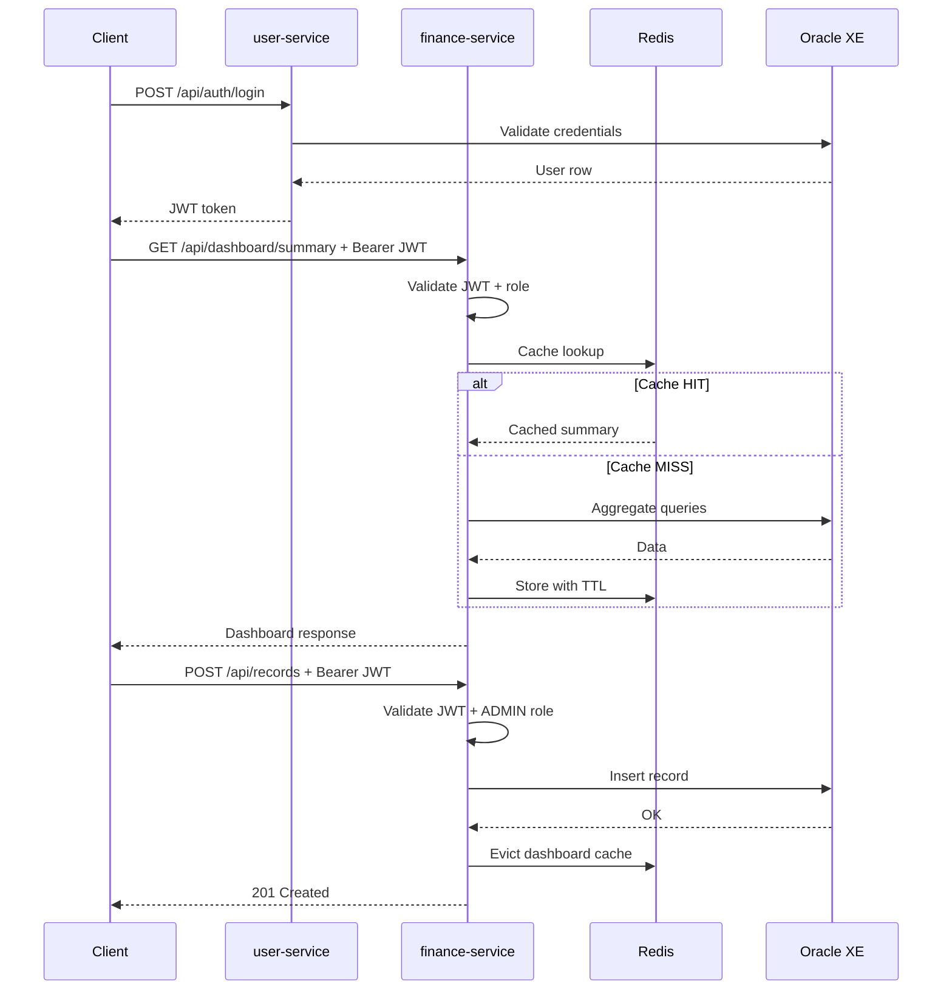
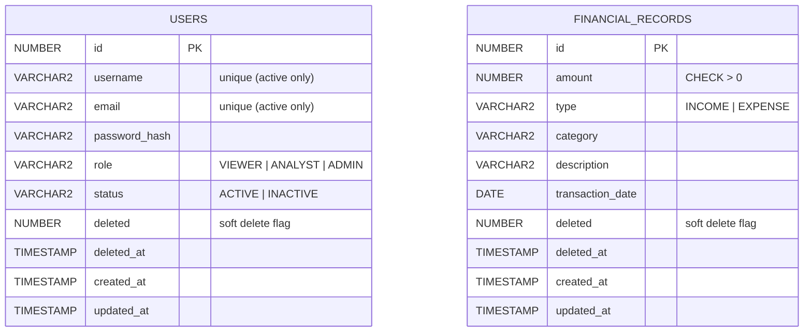

# Zorvyn Assignment

Backend internship evaluation project built with exactly two Spring Boot microservices:

1. `user-service` for identity, authentication, role and user lifecycle management.
2. `finance-service` for financial records, analytics dashboard APIs, and Redis caching.

The implementation focuses on clean backend design, strict RBAC, reliability, and maintainability over unnecessary complexity.

## 1. System Overview



### Services

- `user-service` (`:8081`)
- `finance-service` (`:8082`)
- Oracle XE (`:1521`, `XEPDB1`)
- Redis (`:6379`)

### Why exactly 2 microservices

- The assignment explicitly asks for two services.
- `user-service` owns authentication and user authorization metadata.
- `finance-service` owns finance domain logic and reporting.
- JWT is the only shared contract between services, which keeps boundaries clear.

## 2. Architecture Explanation

Both services follow the same layered architecture:

- `controller -> service -> repository -> entity`
- Shared cross-service DTOs are extracted to a dedicated Maven module: `common`.

Key rules followed:

- DTOs are used for all request/response boundaries.
- Entities are never returned directly.
- Validation is annotation-based (`jakarta.validation`).
- Security is stateless JWT with role checks.
- Global exception handlers return consistent JSON error format.

Reference architecture doc:

- [SYSTEM_ARCHITECTURE.md](SYSTEM_ARCHITECTURE.md)

## 3. Project Structure

```text
zorvyn-assignment/
├── pom.xml
├── common/
│   ├── pom.xml
│   └── src/main/java/com/zorvyn/common/dto/
├── docker-compose.yml
├── run.sh
├── SYSTEM_ARCHITECTURE.md
├── TODO.md
├── bruno/
│   ├── environments/local.bru
│   ├── user-service/*.bru
│   └── finance-service/*.bru
├── user-service/
│   ├── Dockerfile
│   ├── pom.xml
│   └── src/main/
│       ├── java/com/zorvyn/user/
│       │   ├── config/
│       │   ├── controller/
│       │   ├── dto/
│       │   ├── entity/
│       │   ├── exception/
│       │   ├── mapper/
│       │   ├── repository/
│       │   ├── security/
│       │   └── service/
│       └── resources/
│           ├── application.properties
│           └── db/migration/
└── finance-service/
    ├── Dockerfile
    ├── pom.xml
    └── src/main/
        ├── java/com/zorvyn/finance/
        │   ├── cache/
        │   ├── config/
        │   ├── controller/
        │   ├── dto/
        │   ├── entity/
        │   ├── exception/
        │   ├── mapper/
        │   ├── repository/
        │   ├── security/
        │   └── service/
        └── resources/
            ├── application.properties
            └── db/migration/
```

## 4. Access Control Design

### Role matrix

| Endpoint                        | VIEWER | ANALYST | ADMIN |
|---------------------------------|:------:|:-------:|:-----:|
| `GET /api/dashboard/summary`    |   ✓    |    ✓    |   ✓   |
| `GET /api/records`, `GET /{id}` |        |    ✓    |   ✓   |
| `POST/PUT/DELETE /api/records`  |        |         |   ✓   |
| `GET /api/users/me`             |   ✓    |    ✓    |   ✓   |
| All other `/api/users/**`       |        |         |   ✓   |

### Request lifecycle



### Where access is enforced

- HTTP security filter chains:
  - [user SecurityConfig](user-service/src/main/java/com/zorvyn/user/security/SecurityConfig.java)
  - [finance SecurityConfig](finance-service/src/main/java/com/zorvyn/finance/security/SecurityConfig.java)
- Method-level role checks with `@PreAuthorize` in controllers:
  - [UserController](user-service/src/main/java/com/zorvyn/user/controller/UserController.java)
  - [FinancialRecordController](finance-service/src/main/java/com/zorvyn/finance/controller/FinancialRecordController.java)
  - [DashboardController](finance-service/src/main/java/com/zorvyn/finance/controller/DashboardController.java)
- JWT validation filters:
  - [user JwtAuthenticationFilter](user-service/src/main/java/com/zorvyn/user/security/JwtAuthenticationFilter.java)
  - [finance JwtAuthenticationFilter](finance-service/src/main/java/com/zorvyn/finance/security/JwtAuthenticationFilter.java)

### How violations are handled

- Missing/invalid token -> `401 Unauthorized`
- Valid token but insufficient role -> `403 Forbidden`
- Structured response shape from global handlers.

### Additional security safeguards

- Login rate limiting is applied on `POST /api/auth/login` (in-memory, per client key/IP window).
- Password policy enforces uppercase + lowercase + digit + special character.
- Admin safety guards prevent:
  - deleting your own admin account
  - demoting/deactivating/deleting the last active admin

## 5. Data Flow



1. Client logs in through `user-service` (`/api/auth/login`).
2. `user-service` validates credentials against Oracle and returns JWT.
3. Client calls `finance-service` with `Authorization: Bearer <token>`.
4. `finance-service` validates JWT and role, then executes business logic.
5. For dashboard summary and record-by-id reads, `finance-service` checks Redis first, then DB on miss.
6. On record create/update/delete, dashboard cache is evicted, and record-by-id cache is evicted on update/delete.

## 6. Redis Usage

Redis is used in `finance-service` for read-heavy endpoints.

### What is cached

- `dashboardSummary`
- `recordById`

Source:

- [CacheNames](finance-service/src/main/java/com/zorvyn/finance/cache/CacheNames.java)
- [RedisCacheConfig](finance-service/src/main/java/com/zorvyn/finance/config/RedisCacheConfig.java)
- [DashboardServiceImpl](finance-service/src/main/java/com/zorvyn/finance/service/impl/DashboardServiceImpl.java)
- [FinancialRecordServiceImpl](finance-service/src/main/java/com/zorvyn/finance/service/impl/FinancialRecordServiceImpl.java)

### TTL

- Dashboard summary TTL: `5` minutes (default)
- Record-by-id TTL: `2` minutes (default)

### Why cached

- Dashboard summary and record-by-id endpoints are read-heavy.
- Caching reduces repeated aggregate/filter query load.
- Write paths evict cache entries to maintain practical consistency.

## 7. Database Design



### Oracle schema ownership

- `user-service` owns `users`
- `finance-service` owns `financial_records`
- Both use Flyway migrations.

Migration files:

- [user migration SQL](user-service/src/main/resources/db/migration/V1__create_users_table.sql)
- [finance migration SQL](finance-service/src/main/resources/db/migration/V1__create_financial_records_table.sql)

### `users` table highlights

- Fields: username, email, password hash, role, status, soft-delete fields, audit timestamps
- Constraints for role/status validity
- Active-user uniqueness is enforced with function-based unique indexes (soft-deleted records do not block re-creation)
- Indexes on role/status/deleted and lookup fields

### `financial_records` table highlights

- Fields: amount, type, category, description, transaction date, soft-delete fields, audit timestamps
- Constraints for positive amount and valid record type
- Indexes for common filters (`type/date/deleted`, `category/date/deleted`)

## 8. Validation and Reliability

### Validation

- DTO-level validation annotations enforce required fields and formats.
- Request query constraints enforce valid pagination limits.
- Password complexity is validated at request DTO boundary.

### Error handling

- Global exception handlers in both services:
  - [user GlobalExceptionHandler](user-service/src/main/java/com/zorvyn/user/exception/GlobalExceptionHandler.java)
  - [finance GlobalExceptionHandler](finance-service/src/main/java/com/zorvyn/finance/exception/GlobalExceptionHandler.java)
- Internal server exceptions are logged but client responses return sanitized message.
- Method-level authorization denials are normalized to `403 Forbidden`.

### Clean error response format

```json
{
  "timestamp": "2026-04-02T08:14:05.318177Z",
  "status": 401,
  "error": "Unauthorized",
  "code": "UNAUTHORIZED",
  "message": "Authentication is required to access this resource",
  "path": "/api/records",
  "validationErrors": []
}
```

## 9. Pagination and Filtering

### User listing

- `GET /api/users?page=0&size=10&sortBy=createdAt&sortDir=DESC&role=ADMIN&status=ACTIVE&search=admin`

### Finance records listing

- `GET /api/records?page=0&size=10&sortBy=transactionDate&sortDir=DESC&type=EXPENSE&category=Food&dateFrom=2026-01-01&dateTo=2026-12-31&minAmount=10&maxAmount=5000&search=grocery`

## 10. Seed Data

Seeders run on startup when tables are empty.

- [user DataSeeder](user-service/src/main/java/com/zorvyn/user/config/DataSeeder.java)
- [finance DataSeeder](finance-service/src/main/java/com/zorvyn/finance/config/DataSeeder.java)

Default users:

- `admin@zorvyn.local / Admin@123`
- `analyst@zorvyn.local / Analyst@123`
- `viewer@zorvyn.local / Viewer@123`

## 11. OpenAPI / Swagger

- User service Swagger: `http://localhost:8081/swagger-ui.html`
- Finance service Swagger: `http://localhost:8082/swagger-ui.html`

### Unified Swagger on GitHub Pages

This repository includes a single Swagger UI page that can show both services:

- [docs/index.html](docs/index.html)
- Live URL: `https://jay-1409.github.io/zorvyan-assignment/`

It reads static OpenAPI snapshots from:

- `docs/openapi/user-service.json`
- `docs/openapi/finance-service.json`

Export snapshots from running local services:

```bash
./scripts/export-openapi.sh
```

Then commit/push `docs/` and enable GitHub Pages:

1. GitHub repository -> `Settings` -> `Pages`
2. `Build and deployment` -> `Source: Deploy from a branch`
3. Branch: `main`, folder: `/docs`
4. Save

Your unified docs URL will be:

`https://<your-username>.github.io/<your-repo-name>/`

For this repository:

`https://jay-1409.github.io/zorvyan-assignment/`

## 12. How to Run with Docker

From root project directory:

```bash
docker compose up --build
```

Services:

- User service: `http://localhost:8081`
- Finance service: `http://localhost:8082`
- Oracle XE: `localhost:1521/XEPDB1`
- Redis: `localhost:6379`

Docker files:

- [docker-compose.yml](docker-compose.yml)
- [user-service Dockerfile](user-service/Dockerfile)
- [finance-service Dockerfile](finance-service/Dockerfile)

## 13. Local (Non-Docker) Run

Run both services:

```bash
./run.sh
```

Script:

- [run.sh](run.sh)

## 14. API Endpoint List

### user-service

- `POST /api/auth/login` (public)
- `GET /api/users/me` (`VIEWER|ANALYST|ADMIN`)
- `POST /api/users` (`ADMIN`)
- `GET /api/users/{id}` (`ADMIN`)
- `GET /api/users` (`ADMIN`)
- `PUT /api/users/{id}` (`ADMIN`)
- `PATCH /api/users/{id}/role` (`ADMIN`)
- `PATCH /api/users/{id}/status` (`ADMIN`)
- `DELETE /api/users/{id}` (`ADMIN`)

### finance-service

- `GET /api/dashboard/summary` (`VIEWER|ANALYST|ADMIN`)
- `POST /api/records` (`ADMIN`)
- `GET /api/records/{id}` (`ANALYST|ADMIN`)
- `GET /api/records` (`ANALYST|ADMIN`)
- `PUT /api/records/{id}` (`ADMIN`)
- `DELETE /api/records/{id}` (`ADMIN`)

## 15. Sample Request / Response JSON

### Login

Request:

```json
{
  "email": "admin@zorvyn.local",
  "password": "Admin@123"
}
```

Response:

```json
{
  "tokenType": "Bearer",
  "accessToken": "eyJhbGciOiJIUzI1NiJ9...",
  "expiresAt": "2026-04-02T11:30:00Z",
  "user": {
    "id": 1,
    "username": "admin",
    "email": "admin@zorvyn.local",
    "role": "ADMIN",
    "status": "ACTIVE",
    "createdAt": "2026-04-01T22:34:52.888221",
    "updatedAt": "2026-04-01T22:34:52.888221"
  }
}
```

### Create financial record (`ADMIN`)

Request:

```json
{
  "amount": 1250.75,
  "type": "INCOME",
  "category": "Freelance",
  "description": "Client payment",
  "transactionDate": "2026-03-25"
}
```

Response:

```json
{
  "id": 11,
  "amount": 1250.75,
  "type": "INCOME",
  "category": "Freelance",
  "description": "Client payment",
  "transactionDate": "2026-03-25",
  "createdAt": "2026-04-02T13:48:41.612788",
  "updatedAt": "2026-04-02T13:48:41.612788"
}
```

### Dashboard summary

Request:

`GET /api/dashboard/summary?dateFrom=2026-01-01&dateTo=2026-12-31&recentLimit=5`

Response (shape):

```json
{
  "totalIncome": 14600.00,
  "totalExpense": 2700.00,
  "netBalance": 11900.00,
  "categoryTotals": [
    { "category": "Salary", "total": 14200.00 }
  ],
  "recentActivity": [],
  "monthlyTrends": []
}
```

## 16. Bruno API Collection

Bruno collection is ready under:

- [bruno/](bruno)

Start guide:

- [bruno README](bruno/README.md)

## 17. Test Coverage

Current automated tests cover:

- User service:
  - admin safety guard rules in `UserServiceImpl` (last-admin protections and self-delete prevention)
  - RBAC behavior on protected user endpoints (`ADMIN` allowed, `VIEWER` denied)
  - integration auth flow: login then authenticated `/api/users/me` against H2
- Finance service:
  - RBAC behavior on records and dashboard endpoints
  - Global exception policy sanitization for internal errors
  - integration DB-backed CRUD flow (`POST /api/records` then `GET /api/records/{id}`) against H2
  - integration cache behavior (dashboard summary cache hit + write-triggered eviction)

Run tests:

```bash
mvn test
```

## 18. Assumptions

- Oracle XE exposes `XEPDB1`.
- Both services share the same Oracle user in this assignment setup.
- JWT secret is shared by both services for token verification.
- Data seeding is enabled for non-test profiles.

## 19. Tradeoffs Considered

- Chosen: simple two-service split with direct JWT trust for clarity.
- Not chosen: API gateway/service discovery to avoid over-engineering.
- Chosen: cache-aside Redis for dashboard summary with eviction on record writes.
- Tradeoff: current cache serialization requires strict compatibility management across changes.

## 20. Current Improvement Plan

Execution checklist is tracked in:

- [TODO.md](TODO.md)
