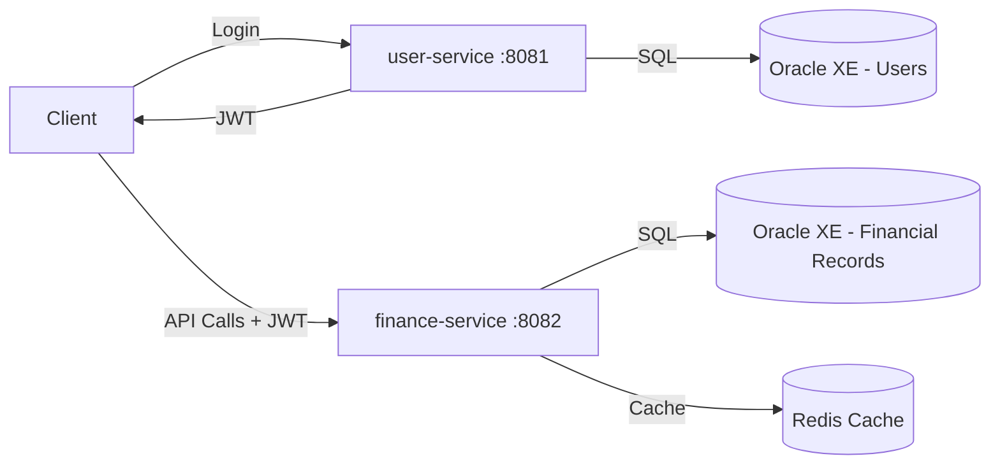
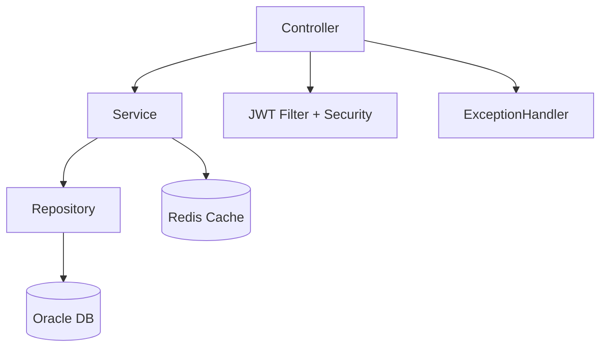
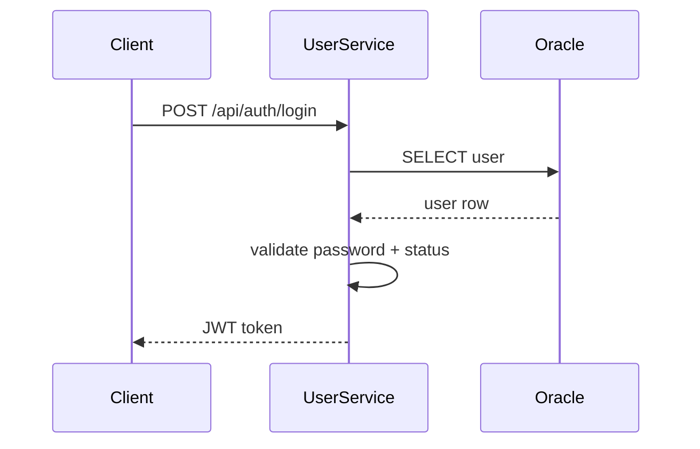
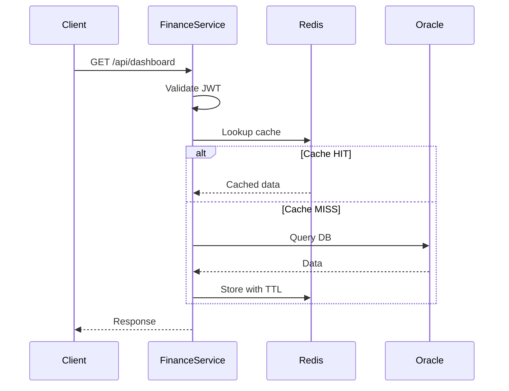
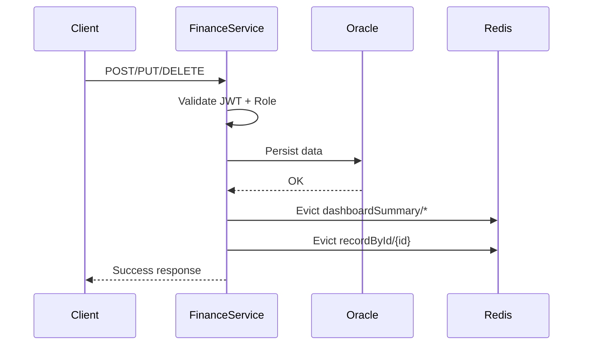
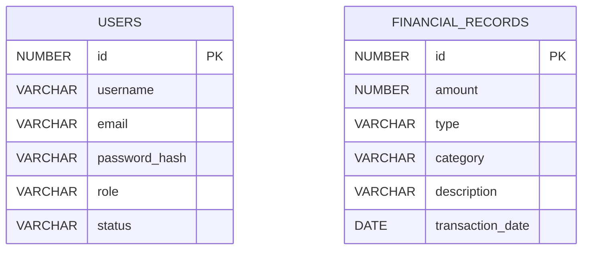

# Zorvyn Backend — System Architecture

## Overview

The Zorvyn backend is composed of **two microservices** backed by Oracle XE and Redis:

| Service           | Port    | Responsibility                                               |
| ----------------- | ------- | ------------------------------------------------------------ |
| `user-service`    | `:8081` | User CRUD, role assignment, authentication, JWT issuance     |
| `finance-service` | `:8082` | Financial records, dashboard reporting, Redis-backed caching |

**Infrastructure:**

* **Oracle XE (XEPDB1)** — system-of-record database
* **Redis** — read cache for the finance service

---

## Architecture Diagram



---

## Service Responsibilities

### `user-service` (:8081)

Owns identity and authentication exclusively.

* User CRUD (create, read, update, soft-delete)
* Role assignment: `VIEWER`, `ANALYST`, `ADMIN`
* User status management: `ACTIVE`, `INACTIVE`
* JWT issuance on successful login
* RBAC enforcement on user-management endpoints

**Boundary rule:** No finance logic lives here. The only output consumed by `finance-service` is the JWT.

---

### `finance-service` (:8082)

Owns the financial domain and reporting.

* Financial record CRUD with filtering and pagination
* Dashboard summary APIs (totals, trends, recent activity)
* JWT validation and role-based authorization
* Redis cache-aside for read-heavy endpoints
* Explicit cache invalidation on every write

**Boundary rule:** No user credential logic lives here. Identity is determined solely by the incoming JWT.

---

## Internal Component Structure



*(Cache applies only to finance-service)*

---

## Request Flows

### 1. Login and Token Issance



---

### 2. Finance Dashboard — Cache-Aside Read



---

### 3. Write with Cache Invalidation



---

## Data Layer

### `users` table — owned by `user-service`

| Column          | Type      | Notes                        |
| --------------- | --------- | ---------------------------- |
| `id`            | PK        |                              |
| `username`      | varchar   |                              |
| `email`         | varchar   |                              |
| `password_hash` | varchar   |                              |
| `role`          | enum      | `VIEWER`, `ANALYST`, `ADMIN` |
| `status`        | enum      | `ACTIVE`, `INACTIVE`         |
| `deleted`       | boolean   | Soft delete                  |
| `deleted_at`    | timestamp |                              |
| `created_at`    | timestamp |                              |
| `updated_at`    | timestamp |                              |

---

### `financial_records` table — owned by `finance-service`

| Column             | Type      | Notes       |
| ------------------ | --------- | ----------- |
| `id`               | PK        |             |
| `amount`           | decimal   |             |
| `type`             | varchar   |             |
| `category`         | varchar   |             |
| `description`      | varchar   |             |
| `transaction_date` | date      |             |
| `deleted`          | boolean   | Soft delete |
| `deleted_at`       | timestamp |             |
| `created_at`       | timestamp |             |
| `updated_at`       | timestamp |             |

---

## ER Diagram



---

## Access Control

### Role Matrix

| Endpoint                 | VIEWER | ANALYST | ADMIN |
| ------------------------ | :----: | :-----: | :---: |
| Dashboard summary        |    ✓   |    ✓    |   ✓   |
| Read records             |        |    ✓    |   ✓   |
| Create / update / delete |        |         |   ✓   |
| User management          |        |         |   ✓   |

---

## Caching Design

| Cache key            | TTL   | Evicted on            |
| -------------------- | ----- | --------------------- |
| `dashboardSummary/*` | 5 min | Any write             |
| `recordById/{id}`    | 2 min | Update/delete by `id` |

**Strategy:** Cache-aside
**Fallback:** On cache failure → query Oracle

---

## Boundary Rules

1. No cross-service DB writes
2. No finance logic in user-service
3. No user credential logic in finance-service
4. JWT is the only shared contract

---

## System Design Principles Applied

| Principle | Applied in this system | Next hardening step |
| --- | --- | --- |
| Single Responsibility | `user-service` owns identity, `finance-service` owns finance domain | Keep this boundary when adding new features |
| Least Privilege Access | Role matrix enforced with `@PreAuthorize` + JWT role claims | Add permission granularity beyond role-only checks |
| Defense in Depth | Security filter + method auth + validation + DB constraints | Add API rate limiting and audit events |
| Fail-Safe Defaults | Unauthorized requests are denied by default (`401/403`) | Add stricter deny rules for sensitive paths |
| Source of Truth | Oracle is canonical data store, Redis is derived cache only | Add schema-level ownership per DB user |
| Cache Consistency | Write operations evict related caches (`dashboardSummary`, `recordById`) | Move from broad dashboard eviction to key-scoped summary invalidation |
| Observability | Centralized exception handler + structured service logs + cache miss logs | Add correlation IDs and metrics dashboard |
| Schema Evolution Discipline | Flyway per service with separate history tables | Add migration backward-compatibility checklist |
| Graceful Degradation | Cache errors fall back to DB path | Add circuit breaker/timeouts for dependency spikes |
| Contract-First API | DTO-based contracts, entities not exposed directly | Add explicit API versioning (`/v1`) |
| Security of Secrets | Runtime via environment variables (DB/Redis/JWT) | Move to secret manager + key rotation |
| Availability over Cache Dependency | Core reads can still succeed when Redis fails | Add readiness probe for Redis optional mode |

---

## Running Locally

```bash
DB_URL=jdbc:oracle:thin:@localhost:1521/XEPDB1
DB_USERNAME=zorvyn-assignment
DB_PASSWORD=1234
REDIS_HOST=localhost
REDIS_PORT=6379

./run.sh
```

---

## Design Tradeoffs

### Shared DB

* Easier setup
* Less isolation

### Evict-all Cache

* Simple
* Lower hit rate

### JWT Shared Secret

* Easy setup
* Not production-grade (should use RSA/JWKS)

---
